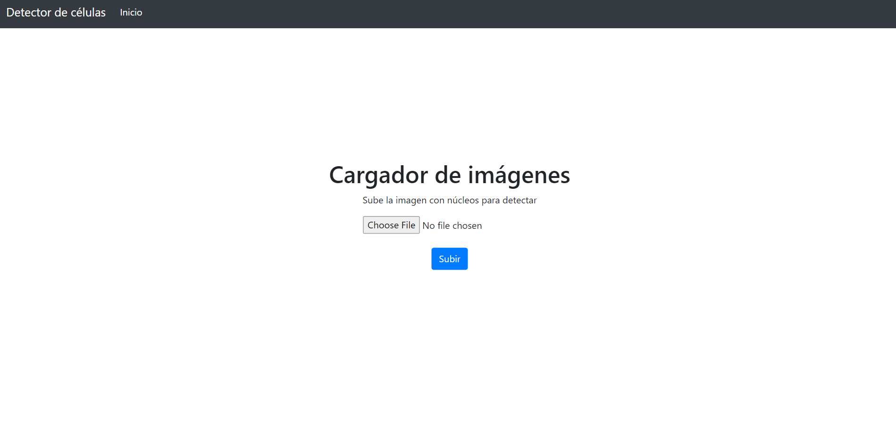
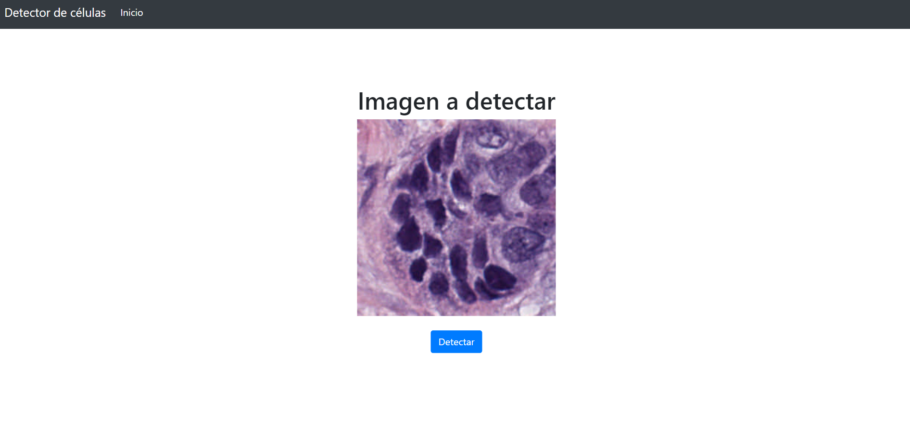
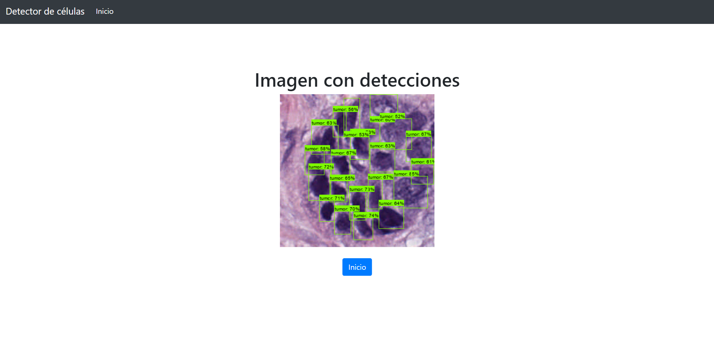

# Detección de núcleos mediante Deep Learning

Este proyecto tiene como objetivo el reentrenamiento mediante fine-tuning de los modelos de detección de objetos, para detectar núcleos de 
células en imágenes histopatológicas.
Se ha utilizado el conjunto de datos NuCLS, de imágenes histopatológicas de cáncer de mama, con anotaciones de posición y categoria de núcleos.
Los modelos reentrenados reciben imágenes como entrada, generan detecciones (localización y clasificación) y los devuelven en un diccionario.

# La estructura del proyecto
    - App/
        - saved_model/
        - static/ 
        - templates/
        - app.py
        - utils.py
        - label_map.pbtxt - fichero de mapa de etiquetas utilizado para inferencia
    
    - Modelos_reentrenados/
        - EfficientDet_D0/
        - EfficientDet_D2/
        - CenterNet_Hourglass-104/
        - SSD_MobileNet_V2_FPNLite/
    
    - label_map.pbtxt     - fichero de mapa de etiquetas (usado para entrenamiento)
    - Utils.py
    - README.md

# La ejecución rápida
A continuación se puede observar un modo de usar modelos para hacer inferencia.
En **image** se pasa una ruta a imagen histopatológica
``` 
import os
import shutil

os.system('git clone https://github.com/Rosss14/cell_detection_project.git)
shutil.move('cell_detection_project/Utils.py', 'Utils.py')

from Utils import *

index = 0 ### Un valor entre 0 y 3, para utilizar 

model_dirs = ['EfficientDet_D0', 'EfficientDet_D2', 'CenterNet_Hourglass-104', 'SSD_MobileNet_V2_FPNLite']
scores = [0.36, 0.33, 0.29, 0.41]

model_dir = model_dirs[index]  ### Elegir el modelo de la lista 
score = scores[index]          ### Elegir el score

model_path = 'cell_detection_project/Modelos_reentrenados/' + model_dir + '/saved_model'

model = tf.saved_model.load(model_path)

image = ''

imagen_detectada = detectar_nucleos(model, imagen, score)


```

# La ejecución de la aplicación web
Para cargar correctamente la aplicación, abrir la carpeta **App/** en Visual Studio Code y ejecutar el script **app.py**.
IMPORTANTE: el programa no funcionará correctamente si se abre cualquier directorio que no sea 'App'.

1. Pulsar el botón **Subir**, elegir una imagen en el ordenador y cargarla.

2. Comprobar que la imagen es la deseada y pulsar el botón **Detectar**. En caso de que se ha equivocado de imagen, pulsar 
**Inicio** en la barra de navegación.

3. Pasados unos segundos, se podrá visualizar la imagen con detecciones. Pulsar **Inicio** para volver a cargar otra imagen.
